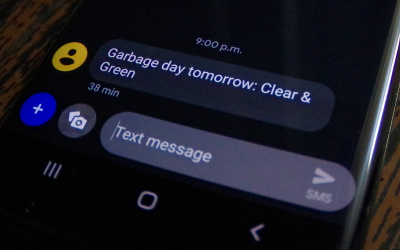

# Garbage-Day-Reminder
Use AWS Lambda to send yourself SMS reminders about garbage day



### Alternating garbage types
Where I live we put out different types of garbage on differnt weeks. It switches back and forth between even & odd weeks. So, the code can also let you know which colour of bags to put out . 

### Trigger
My garbage day is Friday, so I have a CloudWatch Event to trigger this function every Thursday evening. Here's my example expression:
`cron(0 22 ? * Thu *)`
Note that the time is in GMT.

### Environment Variables
This function expects a single environment variable called `NUMBERS` to be a comma separated list of phone numbers to send the notifications to. eg. `+15551234567, +15551234567` or just `+15551234567` for a single number.

### IAM Permissions for SMS
You'll need to give the function SNS permissions in order to send the text messages. Here's what I added to the basic Lambda execution policy:
```
{
  "Effect": "Allow",
  "Action": [
    "sns:Publish"
  ],
  "Resource": "*"
}
```

Also be sure you're in an AWS region which supports mobile SMS in SNS.
